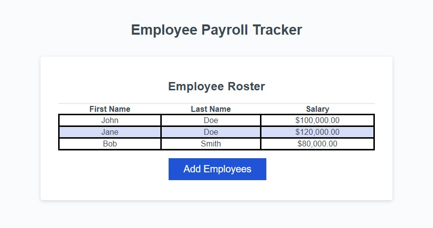

# Employee Payroll Tracker

## Project Overview

This project is a browser-based application that enables a payroll manager to view and manage employee payroll data. It features dynamically updated HTML and CSS powered by JavaScript, providing a clean, polished, and responsive user interface that adapts to multiple screen sizes.

## Table of Contents

- [Usage](#usage)
- [Mock Up](#mock-up)
- [Instructions](#instructions)
- [Key Features](#key-features)
- [Technology Stack](#technology-stack)
- [Additional Resources](#additional-resources)

## Usage

The application runs directly in the browser. A payroll manager can use the "Add Employee" button to enter employee details, which will be displayed on the page and processed for payroll tracking.

## Mock-Up

The following image shows the web application's appearance and functionality:

## Instructions

1. Click the **"Add Employee"** button to begin adding employees.
2. You will be prompted to enter the employee's first name, last name, and salary. The salary should be entered as a number; otherwise, it will default to $0.
3. After entering the employee details, choose to **Continue** to add more employees or **Cancel** to finish.
4. Once canceled, the employees will be displayed on the page in a table, sorted alphabetically by last name.
5. The console will display the average salary, the number of employees, and a random employee as a winner of a drawing.

## Key Features

- **Dynamic Sorting:** Employees are sorted alphabetically by last name.
- **Responsive UI:** Features a polished interface that works across multiple screen sizes.
- **Random Employee Selection:** Chooses and logs a random employee from the list as a drawing winner.
- **Average Salary Calculation:** Logs the average employee salary and the total number of employees to the console.
- **Add Employees:** Prompts the user to input the first name, last name, and salary of multiple employees using a `while` loop.

## Technology Stack

This project uses the following technologies:
- **JavaScript:** Handles employee data collection, sorting, and calculations.
- **HTML and CSS:** Structures and styles the application.
- **Browser Prompt/Confirm Dialogs:** Collects user input and handles interactions.

## Additional Resources

Learn more about how `while` loops work: [MDN Web Docs on while loops](https://developer.mozilla.org/en-US/docs/Web/JavaScript/Reference/Statements/while)

Learn more about how `return` works in functions: [MDN Web Docs on return](https://developer.mozilla.org/en-US/docs/Web/JavaScript/Reference/Statements/return)

Learn more about generating random numbers: [MDN Web Docs on Math.random](https://developer.mozilla.org/en-US/docs/Web/JavaScript/Reference/Global_Objects/Math/random)

Learn more about how `isNaN` can handle invalid input: [MDN Web Docs on isNaN](https://developer.mozilla.org/en-US/docs/Web/JavaScript/Reference/Global_Objects/isNaN)
